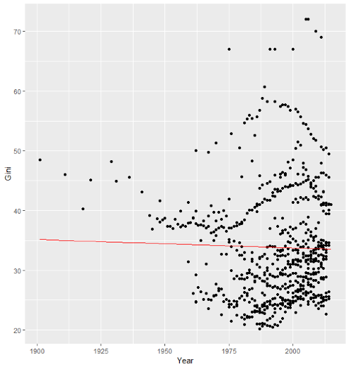

```{r setup, include=FALSE}
knitr::opts_chunk$set(cache = TRUE, message = FALSE, warning = FALSE)
```

## Disuguaglianza dei redditi

> Parlando di disuguaglianza dei redditi si pensa subito che con l'andare degli anni essa aumenti irreversibilmente in tutto il mondo. In questo studio utilizzeremo l'analisi dati per scoprire l'effettivo andamento di questo fenomeno.

> Il seguente plot espone in maniera generale l'andamento negli anni (dal 1900 al 2016) della disugualianza dei redditi.


## Grafico dati grezzi delle nazioni: gini su anno

<div style="text-align:center"></div>

## L'indicatore Gini

> L'indicatore Gini, è una misura volta a rappresentare la disuguaglianza di reddito all'interno di una nazione.

> Di seguito vedremo un boxplot che prende come variabili il Gini e Paese.

## BoxPlot Gini su nazioni

<div style="text-align:center"></div>

## Modello lineare

> Cerchiamo di scoprire la tendenza generale tramite un modello lineare. Il seguente grafico riporta la linea di tendenza ottenuta dal modello. 

## Grafico del modello

<div style="text-align:center"></div>


## Studio togliendo i dati pre-1960

> I dati pre-1960 sono disponibili per pochi paesi, questo fa sì che la linea di tendenza generale in quella zona sia influenzata da solo questi. Ciò comporta un innalzamento della parte iniziale, di seguito proverò a generare un modello sui dati post-1960, più densamente popolati.

## Grafico delle nazioni

<div style="text-align:center"></div>

## Grafico del gini

<div style="text-align:center"></div>

## Grafico della linea di tendenza

<div style="text-align:center"></div>

## Rimozione paesi anomali

> Sono stati tolti i paesi con Gini particolarmente alto per il loro comportamento anomalo. I paesi tolti sono USA, Argentina, Giappone, Brasile, Sud Africa, Malaysia.

## Grafico delle nazioni

<div style="text-align:center"></div>

## Grafico del Gini

<div style="text-align:center"></div>

## Grafico della linea di tendenza

<div style="text-align:center"></div>

## Conclusione

> Trascurando il modello sui dati completi possiamo concludere che in generale la disuguaglianza dei redditi è in aumento.
Tuttavia alcuni paesi con Gini particolarmente alto hanno un trend in diminuzione.
Se queste condizioni verranno rispettate allora potrebbe esserci un valore a cui tendono tutti gli stati.Ammesso che l'ipotesi sia corretta, questo sarà influenzato da fattori attualmente non disponibili, come ad esempio le politiche economiche.